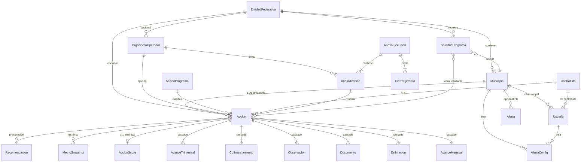

# 03 — Mapa de relaciones y calidad de datos

> Entregable del reanálisis ARKON CONAGUA. Modelo entidad-relación, cardinalidades, notas de calidad y campos infrautilizados.
>
> Fuente: `schema.prisma`, servicios NestJS (`scope.service`, `dashboard.service`), componentes `MapaTerritorial.tsx`.

---

## 1. Diagrama ER (núcleo operativo)



**Entidad central:** `Accion` (CUA). Todo el expediente, la analítica y las alertas cuelgan de ella. Alineación correcta con normativa PROAGUA/PEAS ([08-benchmark-internacional.md](./08-benchmark-internacional.md) §6).

---

## 2. Cardinalidades y reglas de negocio

| Relación | Cardinalidad | On delete | Regla de negocio |
|----------|:------------:|:---------:|------------------|
| Municipio → Accion | 1:N | restrict | Toda acción requiere `municipio_id` |
| Contratista → Accion | 1:N | restrict | Opcional; PRODDER a veces sin contratista formal |
| Accion → AvanceMensual | 1:N | **Cascade** | Serie mensual; único por `periodo` implícito |
| Accion → Estimacion | 1:N | Cascade | Numeración secuencial por obra |
| Accion → Documento | 1:N | Cascade | 8 categorías estándar en seed |
| Accion → AccionScore | 1:1 | Cascade | Tabla analítica; vacía en demo |
| AnexoEjecucion → AnexoTecnico | 1:N | restrict | Un anexo por OO y ejercicio |
| AnexoTecnico → Accion | 1:N | restrict | PEAS 2026 Guanajuato: 2 acciones → 2 anexos |
| SolicitudPrograma → Accion | N:0..1 | SetNull | Solo solicitudes aprobadas generan CUA |
| Usuario → Municipio/Contratista | N:0..1 | — | Scope RBAC: municipal filtra por `municipio_id` |

**Índices críticos ya presentes:** `acciones(municipio_id, estatus, programa)`, `avances_mensuales(obra_id)`, `alertas(atendida, severidad)`.

---

## 3. Campos infrautilizados (evidencia código)

### 3.1 Hidráulicos / MIR — capturados, no explotados

| Campo | Tabla | Seed | Uso actual | Potencial |
|-------|-------|:----:|------------|-----------|
| `caudal_lps` | `acciones` | Sí (AP) | Export PROAGUA únicamente | MIR I.4, dimensionamiento |
| `cobertura_ap_antes/meta` | `acciones` | Sí | Export | MIR I.1, delta de cobertura |
| `cobertura_tar_antes/meta` | `acciones` | Sí | Export | MIR I.2 |
| `pob_incorporar`, `pob_mejorar` | `acciones` | Sí | No | Numerador MIR oficial |
| `caudal_lps` | `activos_hidraulicos` | Vacío | — | Capa A post-obra |

### 3.2 Geoespacial — parcial

| Campo | Tabla | Problema | Acción |
|-------|-------|----------|--------|
| `latitud`, `longitud` | `acciones` | Solo marcadores Leaflet | Choropleth inversión/brecha |
| `latitud`, `longitud` | `municipios` | No usados en mapa | Centroide municipal |
| `marginacion`, `es_zap`, `poblacion` | `municipios` | **NULL en seed** | Índice equidad CONAPO |
| `clave_inegi`, `tipo_localidad` | `municipios` | No poblados | Cruce censal |

### 3.3 Riesgo y estatus — manual vs derivado

| Campo | Problema | Evidencia |
|-------|----------|-----------|
| `riesgo` (string manual) | No correlaciona con brecha físico-financiera | `schema.prisma` L249; badge en `ObraDetailPage` |
| `estatus` = `en_riesgo` | Asignación editorial en seed | No hay trigger automático |
| `ranking_score` | Calculado en API pero **eliminado** antes de responder | `dashboard.service.ts` L314-321 |

---

## 4. Notas de calidad de datos

### 4.1 Integridad referencial

| Hallazgo | Severidad | Detalle |
|----------|:---------:|---------|
| `alertas.municipio` (texto) duplica `municipio_id` | Media | Resolución por nombre en seed; riesgo de desalineación |
| `alertas.obra_id` null en JSON seed | Baja | 8 alertas sin FK a acción; pierden drill-down |
| `fecha_*` como `String` | Alta | Impide orden cronológico SQL confiable |
| Sin UNIQUE en `(accion_id, periodo)` avances | Media | Duplicados posibles en captura |
| `evidencia_fotografica` siempre `[]` | Baja | Multimodal (Nivel 4 IA) bloqueado |

### 4.2 Consistencia físico-financiera (muestra seed)

El seed genera avances mensuales con variación programado−real de −3 % a +2 %. El campo `avance_financiero` en `acciones` es independiente de la suma de estimaciones autorizadas — **brecha sistemática** explotable para detección de anomalías ([04-correlaciones-ocultas.md](./04-correlaciones-ocultas.md)).

### 4.3 Duplicidad semántica contratista / OO

- `contratistas`: 15 registros con RFC placeholder.
- `organismos_operadores`: 15 registros con misma semántica institucional.
- Usuarios `contratista` enlazan a `contratistas`, no a OO.

**Deuda Fase C:** unificar identidad del ejecutor para scorecard de contratistas/OO.

---

## 5. Grafo de dependencias para analítica

```
acciones (BAC, fechas, estatus)
    ├── avances_mensuales → PV, EV (físico)
    ├── estimaciones → AC (financiero)
    ├── avances_trimestrales → reporte CONAC
    ├── documentos → cumplimiento expediente
    ├── alertas + alerta_configs → señales de riesgo
    └── accion_scores ← DESTINO del pipeline analítico
```

Sin poblar `accion_scores`, los dashboards siguen leyendo campos manuales de `acciones`.

---

## 6. Acciones recomendadas (priorizadas)

| # | Acción | Esfuerzo | Impacto |
|---|--------|:--------:|:-------:|
| 1 | Migrar fechas críticas a `Date` o `TIMESTAMPTZ` | Medio | Alto — habilita forecast |
| 2 | UNIQUE `(accion_id, periodo)` en avances mensuales | Bajo | Medio |
| 3 | Poblar `marginacion`/`es_zap` desde CONAPO 2020 | Bajo | Alto — GIS equidad |
| 4 | Enlazar alertas seed a `obra_id` | Bajo | Medio — drill-down |
| 5 | Exponer `ranking_score` y `riesgo_score` en API | Bajo | Alto |
| 6 | Constraint check: `avance_financiero` ≤ 100 | Bajo | Medio |
| 7 | Vista materializada `vw_accion_integridad` | Medio | Alto — QA continuo |

---

## 7. Referencias

- Inventario: [02-inventario-datos.md](./02-inventario-datos.md)
- Correlaciones: [04-correlaciones-ocultas.md](./04-correlaciones-ocultas.md)
- KPIs: [07-catalogo-kpis.md](./07-catalogo-kpis.md)
