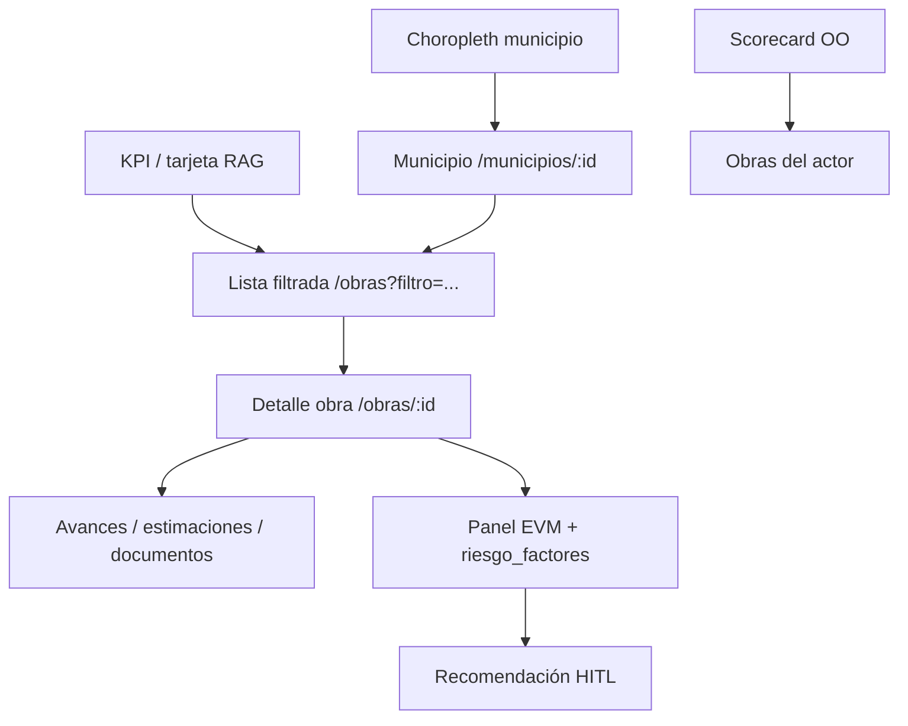

# 06 — Dashboards de siguiente generación (por rol)

> Entregable del reanálisis ARKON CONAGUA. Diseño objetivo de tableros **decision-first**, **por excepción** y con **drill-down** desde KPIs hasta acción/documento. Parte del diagnóstico en [05-evaluacion-dashboards-actual.md](./05-evaluacion-dashboards-actual.md); implementación priorizada en QW4 ([13-quick-wins.md](./13-quick-wins.md)) y KPIs en [07-catalogo-kpis.md](./07-catalogo-kpis.md).
>
> Fuentes: `DashboardEstatalPage.tsx`, `DashboardMunicipalPage.tsx`, `DashboardContratistaPage.tsx`, `metrics.service.ts`, `dashboard.service.ts`, benchmark [08](./08-benchmark-internacional.md) §4.

---

## 0. Resumen ejecutivo

Los dashboards actuales de ARKON son **descriptivos y desbalanceados**: el rol estatal concentra gráficas y mapas; municipal y contratista operan como bandejas transaccionales sin inteligencia comparativa. La siguiente generación invierte el paradigma:

| Principio | Hoy | Objetivo |
|-----------|-----|----------|
| Jerarquía visual | KPIs genéricos arriba | **Panel de excepción** arriba (riesgo, plazos, anomalías) |
| Interacción | Contadores estáticos | **KPI clickable** → lista filtrada en ≤2 clics |
| Alcance | Estatal analítico; otros operativos | **Paridad de métricas** con RBAC (`ScopeService`) |
| Fuente de verdad | Agregados en memoria | **`accion_scores` + jobs** (`MetricsService`) |
| Mapa | Marcadores por estatus | **GIS de decisión** (choropleth, ZAP, brecha) |

**Estado de implementación (jul 2026):** el dashboard estatal ya integra componentes de la nueva generación (`AttentionTodayPanel`, `DataQualityWidget`, `EvmSummaryChart`, `GeoDecisionMap`, `ContractorScorecard`). Municipal y contratista **requieren paridad** (QW4 pendiente de cierre).

---

## 1. Marco de diseño: excepción + drill-down

### 1.1 Las tres preguntas ejecutivas semanales

Todo tablero debe responder, en este orden:

1. **¿Qué requiere mi decisión hoy?** — excepciones, no el portafolio completo.
2. **¿Dónde está el problema y por qué?** — drill-down con factores explicables.
3. **¿Qué acción concreta sigue?** — enlace a bandeja, detalle de obra o aprobación HITL.

Patrón SOTA ([08](./08-benchmark-internacional.md) §4): portafolio "en verde" = escaneo de 30 segundos; el tiempo cognitivo se invierte en **outliers**.

### 1.2 Cadena de drill-down estándar



**Regla:** ningún widget de excepción termina en pantalla muerta; siempre hay `navigate()` o enlace profundo.

### 1.3 Matriz RBAC (`ScopeService` + `PENDIENTE_MATRIX`)

| Rol | Alcance SQL | Excepciones visibles | Acciones permitidas |
|-----|-------------|----------------------|---------------------|
| **estatal** | Portafolio nacional | Top riesgos, anomalías, plazos PROAGUA, recomendaciones | Validar estimaciones estatales, observaciones, solicitudes |
| **municipal** | `municipio_id` | Avances/estimaciones en cola, riesgo local, plazos | Validar avances, estimaciones municipales |
| **contratista** | `contratista_id` | Observaciones, docs faltantes, score propio | Reportar avance, cargar documentos, corregir estimaciones |

La bandeja (`getPendientes()` en `dashboard.service.ts`) ya implementa la matriz por rol; los dashboards next-gen **embeben** su top-5 como widget, no lo duplican en página separada.

---

## 2. Arquitectura de información (layout común)

### 2.1 Zonas fijas por rol

```
┌─────────────────────────────────────────────────────────────┐
│ ZONA A — Excepción (AttentionTodayPanel + cola pendientes)  │
├─────────────────────────────────────────────────────────────┤
│ ZONA B — KPI strip (6–8 métricas RAG + tendencia ↑↓)       │
├──────────────────────────┬──────────────────────────────────┤
│ ZONA C — Inteligencia    │ ZONA D — Operación / contexto    │
│ EVM, riesgo, GIS, MIR    │ Gráficas, mapa, scorecard        │
├──────────────────────────┴──────────────────────────────────┤
│ ZONA E — Export / transparencia (estatal; subset municipal)   │
└─────────────────────────────────────────────────────────────┘
```

### 2.2 Modo "solo excepciones" (Fase PX)

Toggle que oculta KPIs en verde y gráficas de contexto cuando el usuario solo quiere la cola de decisiones. Meta scorecard B9 → 4/5.

---

## 3. Dashboard estatal — Director CONAGUA / coordinación regional

**Usuario:** `estatal@conagua.gob.mx`. **Alcance:** 22 acciones seed (portafolio completo), ~\$462 M MXN autorizados.

### 3.1 Zona A — Qué requiere atención hoy

**Endpoint:** `GET /metrics/attention-today` → `AttentionTodayPanel`.

| Sección | Contenido | Umbral excepción | Drill-down |
|---------|-----------|------------------|------------|
| Top riesgos | `riesgo_score` desde `accion_scores` | ≥ 40 ámbar, ≥ 60 rojo | `/obras/:id#riesgo` |
| Anomalías | `anomalia_score`, brecha FF | \|brecha\| > 15 pp | `/obras?anomalia=1` |
| Plazos PROAGUA | Calendario QW6 (`proaguaComplianceCalendar`) | ≤ 30 días o vencido | `/alertas?tipo=plazo` |
| Recomendaciones | `recomendaciones` pendientes HITL | Cualquier pendiente | `/recomendaciones` |

**Comportamiento al cargar:** `POST /metrics/recompute` (idempotente) garantiza scores frescos antes de pintar excepciones.

### 3.2 Zona B — KPI strip clickable

Reemplazar contadores estáticos de `getKpis()` por tarjetas con semáforo RAG y navegación:

| KPI | ID catálogo | Click → filtro | RAG |
|-----|:-----------:|----------------|-----|
| Acciones en riesgo | K05 → L01 | `?estatus=en_riesgo` + `?riesgo_score_gte=60` | Rojo si ≥3 |
| Retraso en ejecución | K03 | `?estatus=en_ejecucion_retraso` | Rojo si ↑ vs mes |
| % ejercido | L03 | `/obras?sort=brecha_ff` | Ámbar si < avance físico −10 |
| SPI portafolio | E05 | `/obras?spi_lt=0.9` | Rojo si < 0.85 |
| Alertas críticas | K10 | `/alertas?severidad=critica` | Rojo si > 0 |
| Salud portafolio | H01 | `/metrics/portfolio-health` | Verde ≥ 70 |

**Tendencia:** comparar `metric_snapshots` del mes anterior; icono ↑↓ en cada celda.

### 3.3 Zona C — Inteligencia de portafolio

| Widget | Endpoint | Componente | Valor decisorio |
|--------|----------|------------|-----------------|
| EVM resumen | `/metrics/evm` | `EvmSummaryChart` | SPI/CPI/EAC agregados; curva-S PV/EV/AC |
| Calidad de datos | `/metrics/data-quality` | `DataQualityWidget` | `score_global`, % geo/CUA/docs |
| GIS decisión | `/metrics/geo` | `GeoDecisionMap` | Choropleth inversión per cápita; capa `es_zap` |
| Scorecard contratistas | `/metrics/contractors` | `ContractorScorecard` | Ranking 0–100 con drill-down |
| MIR agregado | `/metrics/mir` | *(widget futuro PX)* | I.1–I.4 semáforo estatal |

**Mapa dual:** `GeoDecisionMap` (decisión territorial) + `MapaTerritorial` (ubicación obra a obra) como fallback cuando falta GeoJSON INEGI.

### 3.4 Zona D — Contexto y transparencia

Conservar gráficas existentes con mejoras:

- **Top municipios** — mantener click → `/municipios/:id` ✓
- **Avance físico vs financiero** — resaltar brecha FF > 15 pp en rojo
- **Inversión por programa** — añadir % avance por programa (PROAGUA/PRODDER/PEAS)
- **Export CSV/JSON** — `DashboardExportActions` alineado Obra Pública Abierta

### 3.5 Flujo típico del director (lunes 08:00)

1. Abre dashboard → ve 4 obras en rojo en `AttentionTodayPanel`.
2. Click en CUA `PROAGUA-2024-007` → detalle con `riesgo_factores` JSON.
3. Revisa curva-S: SPI 0.82 → aprueba recomendación "visita supervisión".
4. Exporta briefing semanal (`/metrics/briefing`) para junta.

---

## 4. Dashboard municipal — Ejecutor CORESE / coordinación local

**Usuario:** `municipal@*.gob.mx`. **Alcance:** obras del `municipio_id` (p. ej. 2–4 acciones en seed).

### 4.1 Brecha actual vs objetivo

| Capacidad | Hoy ([05](./05-evaluacion-dashboards-actual.md)) | Next-gen |
|-----------|-----------------------------------------------------|----------|
| Gráficas Recharts | Ausentes | Serie avance + pipeline estimaciones |
| Panel excepción | Solo listas manuales | `AttentionTodayPanel` filtrado |
| Mapa local | Ausente | Mini-mapa obras del municipio |
| Priorización entre obras | No | Ranking riesgo local |
| N+1 avances | `fetchAvancesByObra` en loop | Endpoint agregado `/dashboard/pendientes-avances` |

### 4.2 Layout objetivo

**Zona A — Excepción municipal**

| Ítem | Fuente | Acción |
|------|--------|--------|
| Avances pendientes validar | `PENDIENTE_MATRIX.municipal.avance` | Validar inline |
| Estimaciones en revisión | estatus `presentada`, `en_revision_municipal` | Abrir estimación |
| Plazos PROAGUA del ejercicio | `/metrics/compliance` scoped | Recordatorio |
| Obras con mayor riesgo local | top 3 `riesgo_score` del municipio | Ir a detalle |

**Zona B — KPIs locales (6 métricas)**

- Obras activas / concluidas
- Inversión autorizada vs ejercida (%)
- Avance físico promedio vs programado (brecha)
- Estimaciones en pipeline
- Alertas abiertas
- Cumplimiento documental (L04)

Todos clickable → `/obras?municipio=...&filtro=...`.

**Zona C — Inteligencia**

- **Gráfica de barras:** avance mensual por obra (Recharts, reutilizar lógica `fetchChartAvanceTimeline` con filtro municipal).
- **Embudo estimaciones:** presentada → validada → pagada.
- **Comparación anonimizada:** percentil del municipio vs promedio estatal (sin exponer otros municipios por nombre).

**Zona D — Operación (existente, conservar)**

- Formulario crear estimación
- Alta contratista / obra
- `EstimacionesPendientesList`

### 4.3 Anti-patrón a corregir

```typescript
// DashboardMunicipalPage.tsx L69–77 — N+1 requests
for (const obra of munObras) {
  const avances = await fetchAvancesByObra(obra.id);
  ...
}
```

**Solución:** extender `dashboard.service.ts` con `getPendientesAvancesMunicipio(user)` — una query Prisma con `include: { avancesMensuales: { where: { estatus: { in: [...] } } } } }`.

---

## 5. Dashboard contratista — Organismo operador / empresa ejecutora

**Usuario:** `contratista@*.mx`. **Alcance:** obras con `contratista_id` asignado.

### 5.1 Brecha actual vs objetivo

| Capacidad | Hoy | Next-gen |
|-----------|-----|----------|
| Score propio | Oculto (ranking solo estatal) | **Mi score** + percentil anónimo |
| EVM | Solo en detalle obra (parcial) | Mini-dashboard SPI/CPI por obra |
| Forecast de pago | Ausente | Pipeline estimaciones con SLA |
| Gráficas históricas | Ausentes | Avance reportado vs validado 8 meses |
| Excepciones | Alertas genéricas | Docs observados, avances rechazados |

### 5.2 Layout objetivo

**Zona A — Mi cola de cumplimiento**

| Ítem | Matriz rol | Severidad |
|------|------------|-----------|
| Avances observados | `contratista.avance: [observado]` | Alta |
| Documentos `no_cargado` / `observado` | documento | Alta |
| Estimaciones rechazadas/observadas | estimacion | Alta |
| Hitos próximos 14 días | QW6 + `fecha_termino` | Media |

**Zona B — KPIs de desempeño (6 métricas)**

| KPI | Descripción | Benchmark |
|-----|-------------|-----------|
| Obras asignadas | Conteo activas | — |
| Avance físico promedio | Sobre mis obras | vs percentil 50 |
| **Mi score** | `/metrics/contractors` filtrado | 0–100 + tendencia |
| Brecha FF promedio | L01 agregado | Meta < 10 pp |
| Documentos completos | L04 | Meta ≥ 90 % |
| Días al próximo hito | Min plazo PROAGUA | RAG por proximidad |

**Zona C — Inteligencia de mejora**

- **Gráfica línea:** avance reportado vs validado por periodo (últimos 8 meses seed).
- **Tabla obras:** estatus, SPI, CPI, próximo entregable — click → detalle.
- **Pipeline pagos:** estimaciones por estatus con días en cola.

**Zona D — Operación (existente)**

- Formulario reportar avance mensual
- Tabs entregables / actividad reciente

### 5.3 Scorecard visible al contratista

Exponer componente `ContractorScorecard` en modo **solo fila propia** + percentil ("Estás en el percentil 65 de desempeño"). No revelar scores de competidores identificados — alineado LGPDPPSO ([09](./09-adaptacion-mexico.md)).

---

## 6. Detalle de obra — Hub de drill-down

Toda navegación desde dashboards converge en `ObraDetailPage`:

| Panel | Datos | Interacción |
|-------|-------|-------------|
| Header | CUA, programa, estatus, badge riesgo calculado + manual | Transición QW1 |
| EVM / Curva-S | SPI, CPI, EAC, VAC, TCPI | `/metrics/evm/:accionId` |
| Factores de riesgo | `riesgo_factores` JSON | Barras ponderadas |
| Serie avances | `avances_mensuales` programado/reportado/validado | Tabla + gráfica |
| Estimaciones | Pipeline completo | Acciones según rol |
| Documentos | 8 categorías expediente | IDP futuro (PR) |
| Observaciones | Supervisión | Cerrar/atender |
| Mapa puntual | `latitud`, `longitud` | Leaflet |
| MIR obra | `pob_incorporar`, `caudal_lps`, cobertura | Contribución I.1–I.4 |

---

## 7. Componentes reutilizables (design system)

| Componente | Props clave | Roles |
|------------|-------------|-------|
| `KpiCard` | `value`, `rag`, `trend`, `onClick`, `href` | Todos |
| `AttentionTodayPanel` | `AttentionToday` scoped | Todos |
| `DataQualityWidget` | `DataQualityMetrics` | Estatal (+ municipal opcional) |
| `EvmSummaryChart` | portfolio \| single obra | Estatal, detalle |
| `GeoDecisionMap` | choropleth + ZAP | Estatal |
| `ContractorScorecard` | `mode: full \| self` | Estatal, contratista |
| `DecisionQueueWidget` | top-5 `PendienteItem` | Todos |
| `ComplianceCalendar` | plazos PROAGUA | Estatal, municipal |
| `BrechaFfBadge` | delta físico-financiero | Todos |

**Ubicación sugerida:** `apps/web/src/components/dashboard/` (varios ya existen).

---

## 8. API y contratos de datos

### 8.1 Endpoints existentes / objetivo

| Método | Ruta | Consumidor |
|--------|------|------------|
| GET | `/dashboard/kpis` | KPI strip (legacy + RAG) |
| GET | `/dashboard/pendientes` | Cola decisiones |
| GET | `/metrics/attention-today` | Zona A todos los roles |
| GET | `/metrics/data-quality` | Widget completitud |
| GET | `/metrics/evm` | Curva-S portafolio |
| GET | `/metrics/evm/:accionId` | Detalle obra |
| GET | `/metrics/geo` | Choropleth |
| GET | `/metrics/contractors` | Scorecard |
| GET | `/metrics/compliance` | Plazos PROAGUA |
| GET | `/metrics/mir` | KPIs I.1–I.4 |
| POST | `/metrics/recompute` | Refresh scores al abrir dashboard |

### 8.2 Query params estándar para drill-down (`ObrasPage`)

| Param | Ejemplo | Uso |
|-------|---------|-----|
| `estatus` | `en_ejecucion_retraso` | KPI retraso |
| `programa` | `PROAGUA` | Dona programa |
| `riesgo_gte` | `60` | Excepción riesgo |
| `spi_lt` | `0.9` | EVM bajo |
| `brecha_ff_gt` | `15` | Anomalía FF |
| `municipio_id` | UUID | Scope municipal |
| `contratista_id` | UUID | Scope contratista |

---

## 9. Semáforos RAG y umbrales

Alineados al catálogo [07](./07-catalogo-kpis.md) y PROAGUA:

| Métrica | Verde | Ámbar | Rojo | Fuente |
|---------|-------|-------|------|--------|
| `riesgo_score` | < 40 | 40–69 | ≥ 70 | QW1 |
| SPI / CPI | ≥ 1.0 | 0.85–0.99 | < 0.85 | E05/E06 |
| Brecha FF (pp) | \|Δ\| ≤ 10 | 10–15 | > 15 | L01 |
| `anomalia_score` | < 20 | 20–39 | ≥ 40 | P03 |
| Plazo PROAGUA (días) | > 30 | 8–30 | < 8 o vencido | QW6 |
| Cumplimiento docs | ≥ 90 % | 80–89 % | < 80 % | L04 |
| Data quality global | ≥ 85 | 70–84 | < 70 | F5 |

**Accesibilidad:** color + icono + texto (WCAG 2.1 AA); no depender solo de rojo/verde.

---

## 10. Paridad entre roles — checklist QW4

| Capacidad | Estatal | Municipal | Contratista |
|-----------|:-------:|:---------:|:-----------:|
| Panel excepción | ✓ impl. | ◐ API lista | ◐ pendiente |
| KPI clickable | ◐ parcial | ✗ | ✗ |
| Gráficas Recharts | ✓ | ✗ | ✗ |
| EVM visible | ✓ portafolio | ◐ detalle | ◐ detalle |
| Mapa | ✓ dual | ◐ mini | — |
| Scorecard | ✓ ranking | — | ◐ mi score |
| Cola pendientes embebida | ◐ | ✗ | ✗ |
| Export transparencia | ✓ | ◐ subset | — |

**Meta cierre QW4:** todas las celdas ✓; scorecard B9 → 4/5.

---

## 11. Integración con IA (sin chat obligatorio)

Los dashboards next-gen **consumen** salidas de jobs, no invocan LLM en tiempo real:

| Job | Widget afectado | Fase |
|-----|-----------------|------|
| `computeAccionScores` | Riesgo, EVM, anomalías | F + QW |
| `weeklyExecutiveBriefing` | Link "Descargar briefing" en estatal | PR |
| `generateRecommendations` | Contador en `AttentionTodayPanel` | PX |
| IDP discrepancias | Badge en detalle documento | PR |

Principio [10-oportunidades-ia.md](./10-oportunidades-ia.md): **SQL primero, LLM segundo**.

---

## 12. Plan de implementación por sprint

| Sprint | Entregable | Archivos principales |
|:------:|------------|---------------------|
| S1 | KPI clickable + query params | `KpiCard.tsx`, `ObrasPage.tsx` |
| S2 | Paridad municipal: excepción + gráfica | `DashboardMunicipalPage.tsx`, `AttentionTodayPanel` |
| S3 | Paridad contratista: mi score + pipeline | `DashboardContratistaPage.tsx`, `ContractorScorecard` |
| S4 | Endpoint pendientes agregado (fix N+1) | `dashboard.service.ts` |
| S5 | Modo solo excepciones + briefing link | `DashboardEstatalPage.tsx` |

Esfuerzo total QW4: **2–3 persona-semanas** ([13](./13-quick-wins.md)).

---

## 13. Criterios de aceptación

- [ ] Los tres roles muestran `AttentionTodayPanel` scoped por RBAC
- [ ] 100 % KPIs de Zona B navegan a lista filtrada
- [ ] Municipal tiene ≥2 gráficas Recharts (avance + estimaciones)
- [ ] Contratista ve su score y percentil sin exponer terceros
- [ ] Cero loops N+1 en carga municipal
- [ ] Umbrales RAG consistentes con catálogo 07
- [ ] e2e `conagua-checklist.spec.ts` y `ui-navigation.spec.ts` sin regresión
- [ ] Scorecard B9 ≥ 4/5 tras cierre QW4

---

## 14. Referencias

- Evaluación actual: [05-evaluacion-dashboards-actual.md](./05-evaluacion-dashboards-actual.md)
- Catálogo KPIs: [07-catalogo-kpis.md](./07-catalogo-kpis.md)
- Quick win QW4: [13-quick-wins.md](./13-quick-wins.md) §QW4
- Benchmark UX: [08-benchmark-internacional.md](./08-benchmark-internacional.md) §4
- Roadmap: [12-roadmap-implementacion-priorizado.md](./12-roadmap-implementacion-priorizado.md)
- Scorecard: [16-scorecard-madurez.md](./16-scorecard-madurez.md)
