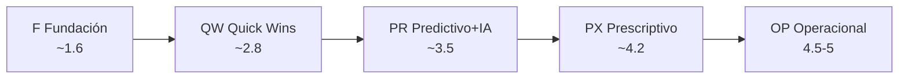
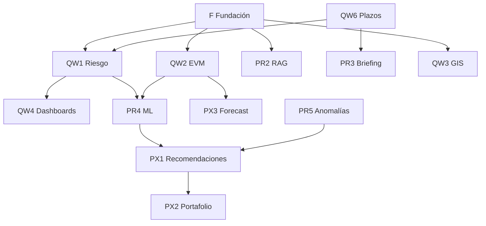

# 12 — Roadmap de implementación priorizado: de 1.1 a madurez 4–5

> Entregable del reanálisis ARKON CONAGUA. Plan **ejecutable** para cerrar la brecha del scorecard ([16-scorecard-madurez.md](./16-scorecard-madurez.md)), alineado al benchmark ([08-benchmark-internacional.md](./08-benchmark-internacional.md)), adaptación México ([09-adaptacion-mexico.md](./09-adaptacion-mexico.md)) e IA backend-first ([10-oportunidades-ia.md](./10-oportunidades-ia.md)). Incluye fases **F → QW → PR → PX → OP**, esfuerzo/impacto/ROI, dependencias y riesgos.

---

## 0. Resumen ejecutivo

| Métrica | Hoy | Post-F | Post-QW | Post-PR | Post-PX | Post-OP* |
|---------|:---:|:------:|:-------:|:-------:|:-------:|:--------:|
| **Índice madurez (Track B)** | 1.1 | ~1.6 | ~2.8 | ~3.5 | ~4.2 | — |
| **Índice global (con Track A)** | 1.1 | ~1.6 | ~2.8 | ~3.5 | ~4.0–4.2 | **4.5–5.0** |
| **Nivel de madurez** | 1 | 1–2 | 2–3 | 3 | 4 | 4–5 |
| **Duración estimada** | — | 3–4 sem | 6–9 sem | 8–12 sem | 10–14 sem | condicional |

\* Fase OP requiere telemetría o registro de activos; sin ella el techo es **~4.0–4.2**.

**Horizonte total:** 9–18 meses calendario con equipo de 2–3 desarrolladores full-stack + apoyo puntual ML/ datos. Las fases son **secuenciales con solapamiento controlado** (p. ej. PR2 RAG puede iniciar al cerrar F).

---

## 1. Principios transversales

1. **Preservar contratos:** endpoints y UI existentes sin regresión; nuevas capacidades tras feature flags.
2. **El LLM narra; SQL calcula** ([10-oportunidades-ia.md](./10-oportunidades-ia.md)).
3. **Tablas derivadas**, no mutar transaccionales para scores.
4. **Re-puntuar scorecard** al cierre de cada fase con evidencia (endpoint, widget, test).
5. **Validación por fase:** `pnpm lint`, `pnpm test`, `pnpm build`, migraciones reversibles, smoke e2e.

---

## 2. Mapa de fases



| Fase | Código | Nombre | Meta índice | Duración | Equipo |
|------|:------:|--------|:-----------:|:--------:|:------:|
| **F** | Fundación | Infra analítica | ~1.6 | 3–4 sem | 2 dev |
| **QW** | Quick Wins | Inteligencia derivada core | ~2.8 | 6–9 sem | 2–3 dev |
| **PR** | Predictivo | IA + ML + RAG | ~3.5 | 8–12 sem | 2–3 dev + ML puntual |
| **PX** | Prescriptivo | Recomendaciones + MIR + gobernanza | ~4.2 | 10–14 sem | 2–3 dev |
| **OP** | Operacional | Track A hidráulico | 4.5–5 | 12+ sem | 2 dev + integración |

---

## 3. Fase F — Fundación

**Objetivo:** habilitar toda analítica posterior sin cambiar UX visible (o mínima: data-quality widget).

### 3.1 Entregables

| ID | Entregable | Descripción | Esfuerzo | Impacto índice |
|----|------------|-------------|:--------:|:--------------:|
| F1 | Módulo `metrics` | Centralizar cálculos; sacar lógica duplicada de `dashboard.service.ts` / `chat.service.ts` | M | B1 +0.5 |
| F2 | Tablas `accion_scores`, `metric_snapshots` | Migración Prisma; índices por `accion_id`, `fecha` | S | B1 +0.3 |
| F3 | Job nocturno recomputo | Extender `alertas-scheduler.service.ts`; idempotente | S | B1 |
| F4 | pgvector + `document_chunks` | `CREATE EXTENSION vector`; esquema embedding | S | B1, B8 infra |
| F5 | Data-quality gate | Endpoint `/metrics/data-quality` + widget completitud | S | B1, confianza |
| F6 | Backfill inicial | Poblar snapshots desde `AvanceMensual` / `Estimacion` | M | — |

**Esfuerzo fase:** ~3–4 persona-semanas. **Impacto:** B1: 2→3; índice **~1.6**.

### 3.2 Dependencias

- Ninguna externa.
- Bloquea: QW1–QW6, PR2, PR3.

### 3.3 Riesgos

| Riesgo | Mitigación |
|--------|------------|
| Migración pgvector en Docker | Probar en `docker compose`; imagen `pgvector/pgvector` si necesario |
| Backfill lento | Batch por acción; job resumible |

### 3.4 Criterios de salida

- [ ] Migraciones aplican clean en CI y local
- [ ] Tests servicio `metrics` > 80% rutas críticas
- [ ] `/dashboard/*` respuestas idénticas a baseline (regresión)
- [ ] Scorecard F actualizado en [16-scorecard-madurez.md](./16-scorecard-madurez.md)

---

## 4. Fase QW — Quick Wins

**Objetivo:** saltar de Nivel 1 a **Nivel 2–3 parcial** con máximo ROI. Detalle por ítem en [13-quick-wins.md](./13-quick-wins.md).

### 4.1 Entregables (resumen)

| ID | Quick Win | Dimensiones | Esfuerzo | Δ índice |
|----|-----------|-------------|:--------:|:--------:|
| QW1 | Riesgo calculado multifactor | B3, B5 | M | +0.30 |
| QW2 | EVM (SPI/CPI/EAC/curva-S) | B2 | M | +0.30 |
| QW3 | GIS de decisión | B6 | B-M | +0.25 |
| QW4 | Dashboards excepción + roles | B9, B10 | M | +0.20 |
| QW5 | Scorecard contratistas visible | B10 | B-M | +0.15 |
| QW6 | Motor plazos PROAGUA | B11 | M | +0.20 |

**Esfuerzo fase:** ~10–14 persona-semanas (paralelizable en 3 tracks: métricas QW1+QW2, front QW4+QW5, geo+compliance QW3+QW6).

**Impacto acumulado:** +~1.2 sobre F → índice **~2.8**.

### 4.2 Orden recomendado dentro de QW

```
Semana 1-2: QW1 + QW2 (mismo módulo metrics)
Semana 2-4: QW6 (compliance; desbloquea factor riesgo)
Semana 3-5: QW3 (GeoJSON INEGI)
Semana 4-6: QW4 + QW5 (frontend)
```

### 4.3 Dependencias

| Entregable | Depende de |
|------------|------------|
| QW1, QW2 | F1, F2, F3 |
| QW6 | F3; catálogo plazos ([09](./09-adaptacion-mexico.md) §3) |
| QW3 | GeoJSON municipal; `claveInegi` en municipios |
| QW4, QW5 | QW1 (badges riesgo en drill-down) |

### 4.4 ROI fase QW

| Métrica | Valor |
|---------|-------|
| Costo relativo | **25%** del roadmap total |
| Valor entregado | **~55%** de la brecha a Nivel 3 |
| Payback | 2–3 meses post-despliegue (menos tiempo manual riesgo/reportes) |

### 4.5 Riesgos

| Riesgo | Prob. | Impacto | Mitigación |
|--------|:-----:|:-------:|------------|
| GeoJSON INEGI desactualizado | Media | Medio | Validar `claveInegi`; fallback marcadores |
| Semántica `es_zap` / `marginacion` | Media | Medio | Documentar en seed; validar con negocio |
| Sobrecarga dashboard | Baja | Medio | Feature flags por widget |

---

## 5. Fase PR — Predictivo + IA

**Objetivo:** **Nivel 3** — ML, IDP, RAG, briefings, anomalías.

### 5.1 Entregables

| ID | Entregable | Dimensiones | Esfuerzo | Δ índice |
|----|------------|-------------|:--------:|:--------:|
| PR1 | IDP PDF + HITL | B7 | M-Alto | +0.15 |
| PR2 | RAG pgvector híbrido | B8 | M | +0.15 |
| PR3 | Briefing ejecutivo semanal | B8, B12 | B-M | +0.10 |
| PR4 | ML retraso/sobrecosto | B4 | M-Alto | +0.15 |
| PR5 | Detección anomalías | B4, B5 | M | +0.10 |
| PR6 | Capa semántica NL métricas | B12 | M | +0.05 |

**Esfuerzo fase:** ~12–16 persona-semanas. **Impacto:** +~0.7 → índice **~3.5**.

### 5.2 Dependencias

- F4 (pgvector) → PR2
- QW1, QW2 → PR4, PR5 (features)
- QW6 → PR3 (plazos en briefing)
- API keys LLM / Azure DI → PR1, PR3

### 5.3 ROI

| Iniciativa | ROI | Notas |
|------------|:---:|-------|
| PR2 RAG | Alto | Sustituye context-stuffing; uso diario revisores |
| PR3 Briefing | Alto | Bajo esfuerzo; alto valor ejecutivo |
| PR1 IDP | Alto medio | Requiere HITL operativo |
| PR4 ML | Medio | N pequeño; gestionar expectativas |

### 5.4 Riesgos

| Riesgo | Mitigación |
|--------|------------|
| N≈22 limita ML | Reglas + regresión; benchmarks cruzados |
| Costo API OpenAI | Caching embeddings; batch nocturno |
| IDP baja precisión OCR | Cola revisión; no auto-write pagos |
| LGPDPPSO en RAG | ACL chunks ([09](./09-adaptacion-mexico.md) §5) |

---

## 6. Fase PX — Prescriptivo

**Objetivo:** **Nivel 4** — recomendaciones, optimización portafolio, forecast, MIR, gobernanza XAI.

### 6.1 Entregables

| ID | Entregable | Dimensiones | Esfuerzo | Δ índice |
|----|------------|-------------|:--------:|:--------:|
| PX1 | Motor recomendaciones + HITL | B4, B12 | M-Alto | +0.15 |
| PX2 | Optimización portafolio multicriterio | B4, B9 | M-Alto | +0.10 |
| PX3 | Forecast erogaciones / curva-S | B2, B4 | M | +0.10 |
| PX4 | KPIs MIR I.1–I.4 + PASH/CONAC | B11 | M | +0.15 |
| PX5 | Gobernanza XAI + anexos versionados | B12, B11 | M | +0.10 |
| PX6 | Export equivalencia SISBA | B11 | B-M | +0.05 |

**Esfuerzo fase:** ~14–18 persona-semanas. **Impacto:** +~0.65 → índice **~4.2** (Track B).

### 6.2 Dependencias

- PR4, PR5 → PX1 (señales prescriptivas)
- `metric_snapshots` → PX3
- Catálogo MIR ([09](./09-adaptacion-mexico.md) §4) → PX4
- PR2 auditoría chunks → PX5

### 6.3 ROI

Prescriptivo tiene ROI **estratégico** más que táctico: mejor asignación de atención ejecutiva y defensa ante ASF. Payback 6–12 meses.

### 6.4 Riesgos

| Riesgo | Mitigación |
|--------|------------|
| Recomendaciones no adoptadas | HITL + cola decisiones en UI QW4 |
| MIR sin datos hidráulicos | OP1 o captura en anexos |
| Complejidad optimización | MVP greedy scoring antes de solver |

---

## 7. Fase OP — Operacional / Track A

**Objetivo:** índice global **4.5–5** explotando dimensión hidráulica y activos. **Condicionada a datos.**

### 7.1 Entregables

| ID | Entregable | Dimensiones | Datos nuevos | Esfuerzo |
|----|------------|-------------|:------------:|:--------:|
| OP1 | KPIs `caudalLps`, cobertura AP/TAR | A5 | No | B-M |
| OP2 | Registro activos post-obra | A1, A2 | Sí (captura) | Alto |
| OP3 | Ingesta SCADA/IoT/AMI | A3, A4 | Sí (telemetría) | Alto |
| OP4 | Mantenimiento predictivo + twin ligero | A1, A2 | Sí (histórico) | Muy alto |

### 7.2 Escenarios

| Escenario | Acciones | Índice global |
|-----------|----------|:-------------:|
| **A — Sin telemetría** | OP1 + preparar ingesta OP2–OP4 | ~4.0–4.2 |
| **B — Con registro activos** | OP1 + OP2 | ~4.3 |
| **C — Con SCADA/AMI** | OP1–OP4 completos | **4.5–5.0** |

### 7.3 Dependencias externas

- CONAGUA / organismos operadores: fuente telemetría o handover post-obra.
- Posible integración Esri / SINA CONAGUA (futuro).

---

## 8. Matriz esfuerzo × impacto (consolidada)

```
Impacto
  ▲
  │  QW1 Riesgo    QW2 EVM      PR2 RAG
  │  QW6 Plazos     PR3 Briefing
  │  ─────────────────────────────────
  │  QW3 GIS        PR1 IDP      PX1 Recom.
  │  QW4 Dash       PR4 ML       PX4 MIR
  │  QW5 Scorecard  PR5 Anomalía PX3 Forecast
  │  F1-F5 Infra     PR6 NL      OP3 SCADA
  └──────────────────────────────────────▶ Esfuerzo
         Bajo              Medio           Alto
```

**Cuadrante prioridad:** alto impacto, esfuerzo medio-bajo → **F, QW1, QW2, QW6, PR2, PR3**.

---

## 9. Trazabilidad dimensión → fase → meta

| Dim | Hoy | F | QW | PR | PX | OP | Meta 18m |
|-----|:---:|:--:|:--:|:--:|:--:|:--:|:--------:|
| B1 Datos unificados | 2 | 3 | | 4 | | | 4 |
| B2 EVM | 1 | | 4 | | 4-5 | | 4-5 |
| B3 Riesgo | 1 | | 4 | | 4-5 | | 4-5 |
| B4 Predictiva | 0 | | | 3 | 4 | | 4 |
| B5 Anomalías | 1 | | 3 | 4 | | | 4 |
| B6 GIS | 1 | | 4 | | 4-5 | | 4-5 |
| B7 IDP | 0 | | | 3 | 4 | | 4 |
| B8 RAG/IA | 1 | | | 3 | 4 | | 4 |
| B9 Dashboards | 2 | | 4 | | 4-5 | | 4-5 |
| B10 Scorecard | 1 | | 4 | | 4-5 | | 4-5 |
| B11 Cumplimiento | 2 | | 4 | | 4-5 | | 4-5 |
| B12 Gobernanza | 1 | | | 3 | 4 | | 4 |
| A1-A5 Operacional | 0-1 | | | | | 3-5 | 3-5 |

---

## 10. Cronograma indicativo (Gantt simplificado)

| Mes | 1 | 2 | 3 | 4 | 5 | 6 | 7 | 8 | 9 | 10 | 11 | 12 |
|-----|---|---|---|---|---|---|---|---|---|----|----|-----|
| F | ███ | | | | | | | | | | | |
| QW | | ████████ | ███ | | | | | | | | | |
| PR | | | | ██████████ | ████ | | | | | | | |
| PX | | | | | | ████████████ | ████ | | | | | |
| OP* | | | | | | | | | ████████████████ | | | |

\* OP puede iniciar OP1 en mes 6 en paralelo a PX.

---

## 11. Dependencias críticas (grafo)



---

## 12. Riesgos programa (registro)

| ID | Riesgo | Fase | Prob | Impacto | Mitigación | Dueño |
|----|--------|------|:----:|:-------:|------------|-------|
| R01 | Regresión API dashboard | Todas | Media | Alto | Tests contrato; snapshot | QA |
| R02 | Datos demo ≠ producción | Todas | Alta | Alto | Banner; import PROAGUA real | Producto |
| R03 | Telemetría no disponible | OP | Alta | Medio | Techo 4.2; OP1 sin sensores | CONAGUA |
| R04 | Cambio normativo anexos | PX | Media | Alto | Versionado ejercicio | Legal |
| R05 | N pequeño ML | PR | Alta | Medio | Reglas primero; honestidad UI | ML |
| R06 | Costo LLM | PR | Media | Bajo | Mini modelos; cache | DevOps |
| R07 | Adopción usuarios | QW+ | Media | Alto | Bandeja + excepción UX | UX |
| R08 | PII en RAG | PR | Media | Alto | LGPDPPSO ACL | Security |

---

## 13. Gates de validación por fase

| Gate | Comandos / evidencia |
|------|---------------------|
| **G-F** | migrate OK; tests metrics; data-quality > 0% |
| **G-QW** | risk score en 100% acciones seed; EVM endpoint; mapa choropleth; e2e conagua-checklist |
| **G-PR** | RAG search < 500ms p95; briefing PDF generado; anomaly flags |
| **G-PX** | MIR export; recomendación HITL flow; audit log |
| **G-OP** | KPIs caudal en dashboard; ingesta mock SCADA |

---

## 14. Inversión y ROI consolidado

| Fase | Persona-semanas | Δ índice | ROI cualitativo |
|------|:---------------:|:--------:|-----------------|
| F | 3–4 | +0.5 | Habilitador; sin ROI directo |
| QW | 10–14 | +1.2 | **Máximo ROI** — inteligencia core |
| PR | 12–16 | +0.7 | Productividad + ejecutivo |
| PX | 14–18 | +0.7 | Cumplimiento + prescripción |
| OP | 15–30+ | +0.3–0.8 | Solo si hay data; SOTA completo |

**Total estimado:** 54–82 persona-semanas para Track B completo (Nivel 4.2); +15–30 si Track A con telemetría.

---

## 15. Conclusión

Este roadmap convierte el diagnóstico del scorecard (1.1/5) en una **secuencia invertible y medible**. La prioridad absoluta es **F + QW**: en ~3 meses ARKON pasa a Nivel 2–3 con riesgo calculado, EVM, GIS decisión y cumplimiento PROAGUA — el núcleo del estado del arte Capa B. PR y PX llevan a Nivel 4 prescriptivo con IA gobernada. OP cierra el círculo hacia madurez 5 cuando exista telemetría.

**Documentos relacionados:** [13-quick-wins.md](./13-quick-wins.md) (detalle QW), [14-vision-estado-del-arte.md](./14-vision-estado-del-arte.md) (horizonte), [15-resumen-ejecutivo.md](./15-resumen-ejecutivo.md) (síntesis para dirección).
