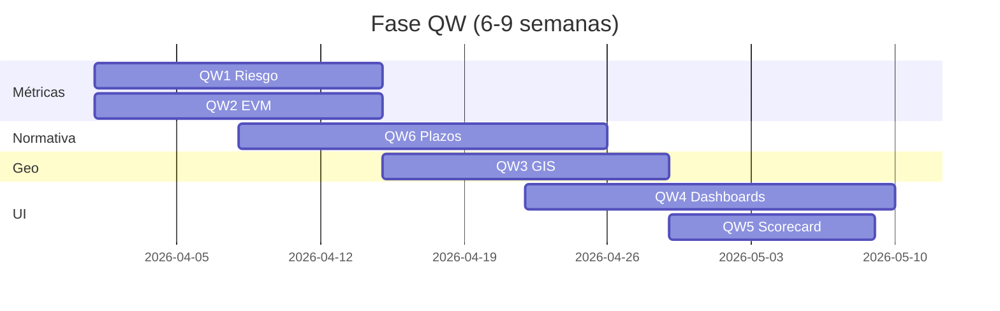

# 13 — Quick wins: seis entregas de alto ROI (QW1–QW6)

> Entregable del reanálisis ARKON CONAGUA. Especificación **completa** de los seis quick wins que conforman la Fase QW del roadmap ([12-roadmap-implementacion-priorizado.md](./12-roadmap-implementacion-priorizado.md)). Cada ítem incluye problema, solución, archivos, datos, esfuerzo e impacto en el scorecard ([16-scorecard-madurez.md](./16-scorecard-madurez.md)).

**Meta de fase:** índice de madurez **~2.8** (Nivel 2–3), sumando **~+1.2** sobre la Fase F (~1.6).

---

## Resumen comparativo

| ID | Nombre | Dim. | Esfuerzo | Δ índice | Dependencia |
|----|--------|------|:--------:|:--------:|-------------|
| **QW1** | Riesgo calculado multifactor | B3, B5 | Medio | +0.30 | Fase F |
| **QW2** | EVM / curva-S | B2 | Medio | +0.30 | Fase F |
| **QW3** | GIS de decisión | B6 | Bajo-Medio | +0.25 | GeoJSON INEGI |
| **QW4** | Dashboards excepción + roles | B9 | Medio | +0.20 | QW1 recomendado |
| **QW5** | Scorecard contratistas | B10 | Bajo-Medio | +0.15 | QW1 opcional |
| **QW6** | Motor plazos PROAGUA | B11 | Medio | +0.20 | Fase F |

---

## QW1 — Riesgo calculado multifactor

### Problema

El campo `riesgo` en `Accion` y el estatus `en_riesgo` son **captura manual**. El KPI `obras_riesgo` en `dashboard.service.ts` cuenta registros con estatus `en_riesgo`, no un score derivado. Esto implica:

- Inconsistencia entre coordinadores.
- Imposibilidad de rankear portafolio objetivamente.
- El asistente y los dashboards narran “riesgo” sin fundamento cuantitativo.

**Evidencia:** `schema.prisma` campos `riesgo`, `en_riesgo`; `dashboard.service.ts` L110, L134.

### Solución

1. **Score 0–100** por acción, persistido en `accion_scores.riesgo_score`.
2. **Factores ponderados** (pesos configurables en `riesgo_config` o env):

| Factor | Peso | Cálculo |
|--------|:----:|---------|
| Rezago físico | 25% | `max(0, avanceFisicoProgramado - avanceFisicoReal)` normalizado |
| Brecha financiera | 20% | `|avanceFinanciero - avanceFisicoReal|` del último mes |
| Días sin actualización | 15% | Desde último `AvanceMensual` o `updatedAt` |
| Alertas abiertas | 15% | Count `Alerta` no resueltas × severidad |
| Desviación presupuestal | 15% | `montoEjercido / montoContratado` vs umbral |
| Proximidad plazos | 10% | Días a hito PROAGUA más próximo (QW6) |

3. **Semaforo:** Verde <40, Ámbar 40–69, Rojo ≥70.
4. **Explicabilidad:** JSON `factores_json` con contribución por factor.
5. **Job nocturno** + endpoint `GET /metrics/riesgo/:accionId` y agregado `/dashboard/riesgo`.
6. **UI:** badge en `ObrasPage.tsx`, `ObraDetailPage.tsx`; widget “Top obras en riesgo” en dashboards.

**No reemplazar** de inmediato el enum `en_riesgo` manual — sincronizar opcionalmente cuando `riesgo_score >= 70`.

### Archivos a modificar / crear

| Capa | Archivo | Cambio |
|------|---------|--------|
| API | `apps/api/src/metrics/metrics.module.ts` | **Nuevo** módulo |
| API | `apps/api/src/metrics/riesgo.service.ts` | Cálculo y persistencia |
| API | `apps/api/src/metrics/metrics.controller.ts` | Endpoints |
| API | `apps/api/prisma/schema.prisma` | Modelo `AccionScore` |
| API | `apps/api/src/alertas/alertas-scheduler.service.ts` | Job recomputo |
| Web | `apps/web/src/pages/ObrasPage.tsx` | Columna/badge riesgo |
| Web | `apps/web/src/pages/ObraDetailPage.tsx` | Panel desglose factores |
| Web | `apps/web/src/pages/DashboardEstatalPage.tsx` | Widget top riesgos |
| Web | `apps/web/src/lib/api.ts` | Tipos y fetch |

### Datos requeridos

**Todos existentes** en seed: avances mensuales (176), alertas (8), montos, fechas. Sin ingesta nueva.

### Esfuerzo

**Medio** — 2–3 persona-semanas (servicio + migración + UI + tests).

### Impacto

- **B3:** 1 → 4
- **B5:** 1 → 3 (base para anomalías PR5)
- **Δ índice global:** +0.30

---

## QW2 — EVM e inteligencia de cronograma (SPI, CPI, EAC, curva-S)

### Problema

ARKON muestra promedios de avance y `avance-timeline`, pero **no calcula** Earned Value Management:

- Sin SPI (Schedule Performance Index) ni CPI (Cost Performance Index).
- Sin EAC (Estimate at Completion) ni proyección de sobrecosto.
- Sin curva-S (PV/EV/AC acumulados).

**Evidencia:** `dashboard.service.ts` agregados simples; sin módulo EVM.

### Solución

1. **Definiciones para dominio obra pública:**

| Variable | Mapeo ARKON |
|----------|-------------|
| BAC | `montoAutorizado` |
| PV | BAC × `avanceFisicoProgramado` acumulado por periodo |
| EV | BAC × `avanceFisicoReal` acumulado |
| AC | `montoEjercido` acumulado por `AvanceMensual` |

2. **Índices:** SPI = EV/PV; CPI = EV/AC; EAC = AC + (BAC−EV)/CPI; TCPI, VAC.
3. **Curva-S:** series mensuales en `metric_snapshots` (tipo `evm`).
4. **Endpoints:** `GET /metrics/evm/:accionId`, `GET /dashboard/evm?programa=`.
5. **UI:** gráfica curva-S en `ObraDetailPage.tsx`; tarjetas SPI/CPI en dashboards estatal.

### Archivos

| Capa | Archivo | Cambio |
|------|---------|--------|
| API | `apps/api/src/metrics/evm.service.ts` | **Nuevo** |
| API | `apps/api/src/metrics/metrics.controller.ts` | Rutas EVM |
| API | `apps/api/src/dashboard/dashboard.service.ts` | Delegar agregados EVM |
| Web | `apps/web/src/pages/ObraDetailPage.tsx` | Tab o sección Curva-S |
| Web | `apps/web/src/components/dashboard/EvmChart.tsx` | **Nuevo** componente Recharts |
| Web | `apps/web/src/pages/DashboardEstatalPage.tsx` | KPIs SPI/CPI portafolio |

### Datos requeridos

Existentes: `montoAutorizado`, `montoEjercido`, `avanceFisicoProgramado`, `avanceFisicoReal`, `AvanceMensual` por mes.

**Supuesto:** si `avanceFisicoProgramado` es estático por acción, interpolar curva PV lineal entre inicio y fin programados (`fechaInicio`, `fechaFin`).

### Esfuerzo

**Medio** — 2–3 persona-semanas.

### Impacto

- **B2:** 1 → 4
- **Δ índice:** +0.30
- Habilita PR4 (ML) y PX3 (forecast).

---

## QW3 — GIS de decisión (choropleth, ZAP, índice de brecha)

### Problema

`MapaTerritorial.tsx` muestra **solo marcadores** de obra en el dashboard estatal. No hay:

- Agregación por municipio (inversión, # obras, % retraso).
- Choropleth por métrica seleccionable.
- Capa de Zonas de Atención Prioritaria (`es_zap`).
- Índice de brecha equitativa (marginación × población vs inversión per cápita).

**Evidencia:** componente Leaflet básico; campos `marginacion`, `poblacion`, `es_zap` en schema infrautilizados.

### Solución

1. **Endpoint** `GET /dashboard/geo?metrica=inversion|avance|riesgo|brecha`:
   - Agregar por `municipio.claveInegi`.
   - Join con GeoJSON municipal INEGI (estático en `apps/api/assets/geo/` o CDN).
2. **Choropleth** en `MapaTerritorial.tsx` con leyenda y selector de métrica.
3. **Símbolos proporcionales** opcionales: radio = monto, color = riesgo (QW1).
4. **Capa ZAP:** filtro/highlight municipios con `es_zap = true`.
5. **Índice brecha:** `(marginacion_norm × poblacion) - (inversion_per_capita_norm)` — documentar fórmula en tooltip.

### Archivos

| Capa | Archivo | Cambio |
|------|---------|--------|
| API | `apps/api/src/dashboard/dashboard.controller.ts` | Ruta `/geo` |
| API | `apps/api/src/dashboard/dashboard.service.ts` | `getGeoAggregates()` |
| API | `apps/api/assets/geo/municipios-yucatan.json` | **Nuevo** (o entidad federativa seed) |
| Web | `apps/web/src/components/dashboard/MapaTerritorial.tsx` | Choropleth GeoJSON layer |
| Web | `apps/web/src/pages/DashboardEstatalPage.tsx` | Controles métrica/capa ZAP |

### Datos requeridos

- Existentes: coordenadas, `claveInegi`, `marginacion`, `poblacion`, `es_zap`, montos por acción.
- **Nuevo (asset):** GeoJSON municipal INEGI para la entidad del demo (Yucatán u otra del seed).

### Esfuerzo

**Bajo-Medio** — 1.5–2.5 persona-semanas.

### Impacto

- **B6:** 1 → 4
- **Δ índice:** +0.25

---

## QW4 — Dashboards por excepción, paridad de roles y KPI clickable

### Problema

- Dashboard **estatal-heavy**; `DashboardMunicipalPage` y `DashboardContratistaPage` con métricas limitadas y sin gráficas comparables.
- KPIs en tarjetas **no navegan** a listas filtradas.
- Falta panel **“Qué requiere atención hoy”** (excepciones, no todo el portafolio).
- Sin umbrales RAG con tendencia (flecha ↑↓ vs periodo anterior).

**Evidencia:** `DashboardEstatalPage.tsx` extenso; municipal/contratista principalmente conteos.

### Solución

1. **Panel excepción** (los tres roles, scoped por RBAC):
   - Top N riesgo (QW1).
   - Decisiones en cola / días de espera (bandeja existente).
   - Plazos PROAGUA vencidos próximos 7 días (QW6).
2. **KPI clickable:** `onClick` → `/#/acciones?filtro=...` con query params.
3. **RAG visual:** Verde/Ámbar/Rojo según variación % vs mes anterior; icono tendencia.
4. **Paridad gráficas:** Recharts en municipal (avance propio, estimaciones pendientes) y contratista (mis obras, cumplimiento hitos).
5. **Cola de decisiones:** ítems de `GET /dashboard/pendientes` con antigüedad destacada.

### Archivos

| Capa | Archivo | Cambio |
|------|---------|--------|
| Web | `apps/web/src/pages/DashboardEstatalPage.tsx` | Panel atención + KPI links |
| Web | `apps/web/src/pages/DashboardMunicipalPage.tsx` | Gráficas + excepción |
| Web | `apps/web/src/pages/DashboardContratistaPage.tsx` | Idem |
| Web | `apps/web/src/components/dashboard/AttentionPanel.tsx` | **Nuevo** |
| Web | `apps/web/src/components/dashboard/KpiCard.tsx` | RAG + onClick |
| Web | `apps/web/src/pages/ObrasPage.tsx` | Leer query params filtro |
| API | `apps/api/src/dashboard/dashboard.service.ts` | `getAttentionItems()` |

### Datos requeridos

Existentes + QW1 scores + pendientes API.

### Esfuerzo

**Medio** — 2–3 persona-semanas (mayoría frontend).

### Impacto

- **B9:** 2 → 4
- **Δ índice:** +0.20

---

## QW5 — Scorecard de contratistas y organismos operadores visible

### Problema

`dashboard.service.ts` calcula `ranking_score = avancePromedio - alertasActivas * 5` pero **lo elimina** antes de retornar (`.map(({ ranking_score: _rs, ...rest }) => rest)`). Los usuarios no ven desempeño comparativo de contratistas/OO.

### Solución

1. **Índice ponderado 0–100** por contratista y organismo:

| Componente | Peso |
|------------|:----:|
| Cumplimiento plazos | 30% |
| Avance físico promedio | 25% |
| Alertas activas (inverso) | 20% |
| Calidad documental (% docs completos) | 15% |
| Brecha físico-financiera promedio | 10% |

2. **Endpoint** `GET /dashboard/scorecard-contratistas` y `...-organismos`.
3. **UI:** tabla rankeada en `ContratistaPanelPage.tsx` o sección dashboard estatal; drill-down a obras del actor.
4. **Tendencia:** comparar score mes actual vs snapshot anterior.

### Archivos

| Capa | Archivo | Cambio |
|------|---------|--------|
| API | `apps/api/src/dashboard/dashboard.service.ts` | Exponer ranking; método scorecard |
| API | `apps/api/src/contratistas/contratistas.service.ts` | Agregados por contratista |
| Web | `apps/web/src/pages/ContratistaPanelPage.tsx` o dashboard | Tabla scorecard |
| Web | `apps/web/src/components/dashboard/ScorecardTable.tsx` | **Nuevo** |

### Datos requeridos

Existentes: relación acción–contratista, alertas, avances, documentos por acción.

### Esfuerzo

**Bajo-Medio** — 1–2 persona-semanas.

### Impacto

- **B10:** 1 → 4
- **Δ índice:** +0.15

---

## QW6 — Motor de plazos PROAGUA / PRODDER / PEAS

### Problema

Reglas PROAGUA están **dispersas** en `alerta-config-evaluator.service.ts`, `alertas-scheduler.service.ts` y seed `PROAGUA_ALERTA_CONFIGS`. No hay:

- Calendario normativo **versionado por ejercicio fiscal**.
- Vista de cumplimiento por hito en detalle de obra.
- Diferenciación PROAGUA vs PEAS (plazos distintos post-mar-2026).

**Evidencia:** reglas `plazo_contratacion`, reintegro TESOFE parciales en evaluator.

### Solución

1. **Tablas** `regla_plazo(programa, ejercicio, tipo_hito, dias, tipo_dia, ancla, sancion)` y `cumplimiento_hito(accion_id, tipo_hito, fecha_limite, cumplido, evidencia)`.
2. **Módulo** `apps/api/src/compliance/` con servicio de evaluación y catálogo seed 2025/2026.
3. **Hitos mínimos PROAGUA 2025** (ver [09-adaptacion-mexico.md](./09-adaptacion-mexico.md) §3.1):
   - Comité Técnico 30d hábiles
   - Formalización anexo 5d hábiles
   - Contratación / licitación
   - Avance mensual días 1–5
   - Conclusión 31-dic
   - Cierre enero
   - Reintegro TESOFE 15d naturales
4. **Integración alertas:** generar `Alerta` cuando `fecha_limite - hoy < umbral`.
5. **UI:** widget “Cumplimiento normativo” en `ObraDetailPage.tsx` (semáforo por hito); resumen en dashboard estatal.

### Archivos

| Capa | Archivo | Cambio |
|------|---------|--------|
| API | `apps/api/src/compliance/compliance.module.ts` | **Nuevo** |
| API | `apps/api/src/compliance/plazos.service.ts` | Motor evaluación |
| API | `apps/api/src/compliance/plazos.catalog.ts` | Catálogo 2025/2026 |
| API | `apps/api/src/alerta-configs/alerta-config-evaluator.service.ts` | Delegar a compliance |
| API | `apps/api/prisma/schema.prisma` | Modelos plazo |
| Web | `apps/web/src/pages/ObraDetailPage.tsx` | Widget cumplimiento |
| Web | `apps/web/src/components/compliance/PlazosWidget.tsx` | **Nuevo** |

### Datos requeridos

Existentes: fechas de acción, contrato, estimaciones, montos reintegro. Opcional: fechas de dictamen si no están, captura gradual.

### Esfuerzo

**Medio** — 2–3 persona-semanas.

### Impacto

- **B11:** 2 → 4
- **Δ índice:** +0.20
- Alimenta factor “proximidad plazos” en QW1.

---

## Orden de implementación recomendado

---

## Criterios de aceptación (fase QW completa)

- [ ] 100% acciones seed con `riesgo_score` y desglose JSON
- [ ] SPI/CPI visibles en detalle de obra y dashboard estatal
- [ ] Mapa con choropleth y capa ZAP funcional
- [ ] KPI estatal navega a listado filtrado
- [ ] Scorecard contratistas visible con ≥5 filas en demo
- [ ] Widget plazos muestra ≥5 hitos PROAGUA por acción activa
- [ ] e2e `conagua-checklist.spec.ts` pasa sin regresión
- [ ] Scorecard actualizado: índice **~2.8**

---

## Conclusión

Los seis quick wins transforman ARKON de un sistema **descriptivo** a uno **analítico** sin esperar ML ni telemetría. QW1 y QW2 son el corazón (riesgo + EVM); QW6 ancla legitimidad normativa; QW3–QW5 mejoran decisión y equidad. Juntos representan el **mayor retorno por peso invertido** en todo el programa de transformación.
