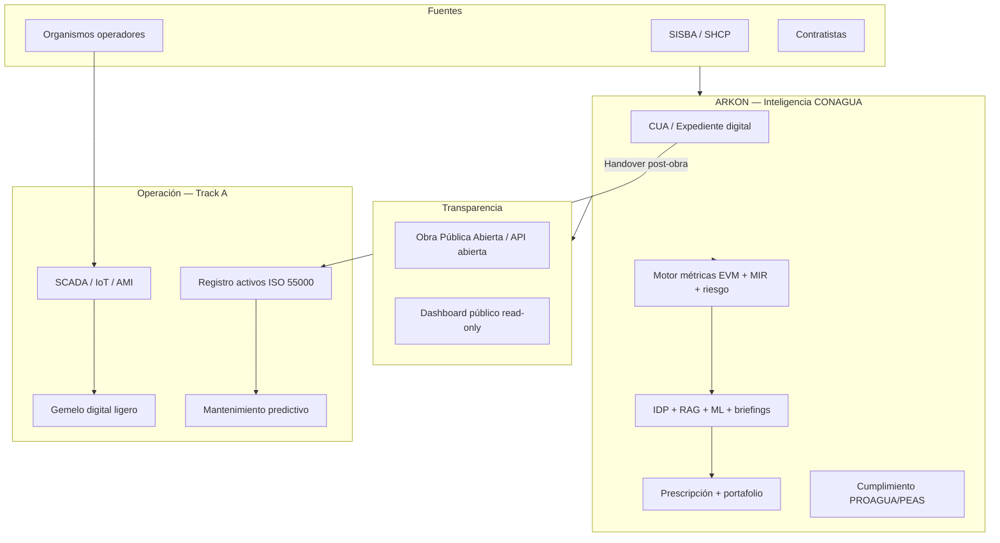

# 14 — Visión estado del arte: gestión de infraestructura hídrica en México (horizonte 2026–2030)

> Entregable del reanálisis ARKON CONAGUA. Describe el **horizonte de largo plazo** hacia el que apunta la transformación del sistema — la convergencia de Capa B (programas de capital) y Capa A (operación de activos) en un ecosistema digital coherente para el sector hídrico mexicano. Complementa el benchmark ([08-benchmark-internacional.md](./08-benchmark-internacional.md)) y el roadmap ([12-roadmap-implementacion-priorizado.md](./12-roadmap-implementacion-priorizado.md)).

---

## 0. Tesis de visión

Para 2030, la gestión de infraestructura hídrica en México no se medirá solo por **obras entregadas**, sino por **resultados sostenibles en acceso, calidad, eficiencia y resiliencia** — con trazabilidad desde el peso federal (CUA) hasta el litro entregado en el grifo. ARKON CONAGUA puede convertirse en el **sistema nervioso digital** de esa cadena: no reemplazando SISBA, SCADA ni ERP, sino **unificando inteligencia** sobre programas PROAGUA/PEAS, expedientes, desempeño de contratistas y, cuando existan, activos operativos.

La visión tiene **dos velocidades**:

1. **Track B (2026–2028):** estado del arte en **obra pública hídrica federal** — alcanzable con datos actuales.
2. **Track A (2028–2030):** estado del arte **operativo** — condicionado a telemetría, registro de activos e integración con organismos.

---

## 1. El problema nacional que la visión resuelve

### 1.1 Fragmentación actual

| Actor | Sistema típico | Brecha |
|-------|----------------|--------|
| CONAGUA / dirección general | Excel, SISBA, correo | Sin scoring unificado de portafolio |
| Entidades federativas | Portales estatales dispares | Datos no comparables |
| Organismos operadores | SCADA propietario, CMMS aislado | Obra federal desconectada de operación |
| Contratistas | ERP interno | Sin scorecard transparente |
| Ciudadanía | Obra Pública Abierta (trimestral) | Granularidad limitada |
| Fiscalización (ASF) | Muestreo documental | Sin trazabilidad algorítmica |

### 1.2 Costo de la fragmentación

- Retrasos detectados tarde (cuando ya hay sanción o reintegro).
- Duplicación de captura (mismo avance en PDF, Excel y portal).
- Inversión desalineada con marginación y ZAP.
- Activos entregados sin **handover digital** al operador.
- Imposibilidad de aprendizaje institucional (cada ejercicio “empieza de cero”).

---

## 2. Arquitectura objetivo 2030



### 2.1 Principios arquitectónicos

| Principio | Descripción |
|-----------|-------------|
| **CUA como hilo conductor** | Toda obra, documento, score y activo derivado referencia la CUA |
| **SQL primero, LLM segundo** | Números auditables; narrativa generada |
| **Open by default (agregados)** | Transparencia en montos y avance; expediente con RBAC |
| **Norma como código** | Plazos y anexos versionados por ejercicio |
| **Interoperabilidad** | APIs hacia SISBA, no monolito cerrado |
| **Soberanía de datos** | PostgreSQL on-prem o nube nacional; LGPDPPSO |

---

## 3. Capa B — Estado del arte en programas de capital (meta 2027)

### 3.1 Capacidades maduras

Al cerrar Fases F → QW → PR → PX ([12-roadmap](./12-roadmap-implementacion-priorizado.md)), ARKON exhibe:

| Capacidad | Manifestación usuario |
|-----------|----------------------|
| **Portafolio vivo** | Mapa choropleth + ranking riesgo + brecha equitativa ZAP |
| **Cronograma inteligente** | Curva-S, SPI/CPI, fecha término probable |
| **Cumplimiento automático** | Semáforo de hitos PROAGUA; alertas antes de sanción |
| **Expediente inteligente** | IDP extrae PDFs; RAG cita norma y anexos |
| **Ejecutivo informado** | Briefing semanal PDF; cola de decisiones |
| **Contratistas responsables** | Scorecard público interno con tendencia |
| **Prescripción gobernada** | “Reasignar supervisión a obra X” con HITL |
| **Reporte oficial** | MIR I.1–I.4, exports PASH/CONAC versionados |

**Índice madurez:** 4.0–4.2 / 5 (Nivel 4 Prescriptivo).

### 3.2 Comparación con referentes internacionales

| Dimensión | Sydney Water + InEight | Obra Pública Abierta MX | **ARKON visión B** |
|-----------|------------------------|-------------------------|---------------------|
| EVM integrado | Sí | No | Sí |
| Score contratistas | Sí (12 constructoras) | No | Sí |
| GIS decisión | Parcial | Mapa básico | Choropleth + brecha |
| IA documental | Emergente | No | IDP + RAG |
| Normativa local | Australia | N/A | PROAGUA/PEAS motor |
| Tiempo real | Alta frecuencia | Trimestral | Mensual + jobs |

ARKON visión B **supera** transparencia federal actual y **iguala** capacidades de portafolio de utilities australianas en la capa de capital — con la ventaja de estar **nativamente alineado a MIR y CUA**.

---

## 4. Capa A — Estado del arte operativo (meta 2028–2030)

### 4.1 El salto: de obra entregada a servicio sostenido

México invierte miles de millones en PROAGUA, pero el **ciclo de vida del activo** (bomba, red, PTAR) a menudo queda fuera del radar federal una vez firmada el acta de entrega. La visión Track A cierra el ciclo:

```
Inversión (CUA) → Construcción (EVM) → Entrega (anexo XXIII) →
  Registro activo (ISO 55000) → Operación (SCADA) →
  Mantenimiento predictivo → Renovación (nueva CUA)
```

### 4.2 Capacidades Track A

| Capacidad | Descripción | Referente global |
|-----------|-------------|------------------|
| **Registro de activos** | Bombas, tramos, PTAR con criticidad PoF×CoF | Oracle WAM, IBM Maximo |
| **KPIs hidráulicos** | Caudal, presión, NRW, cobertura AP/TAR | Bentley WaterSight |
| **Integración SCADA** | Ingesta batch o streaming presión/flujo/energía | Esri UN + SCADA |
| **Gemelo digital ligero** | Modelo hidráulico simplificado what-if | Innovyze Info360 |
| **PdM** | RUL bombas, anomalías de consumo energético | Xylem Vue, Siemens SIWA |
| **NRW inteligente** | DMAs virtuales cuando haya AMI | IWA best practice |

**Campos ya en schema ARKON:** `caudalLps`, cobertura AP/TAR — primer paso sin sensores (OP1).

### 4.3 Modelo de integración con organismos

No se impone un SCADA único. ARKON adopta **hub de integración**:

- Conectores: OPC-UA, MQTT, CSV programado, API REST.
- Normalización a `telemetria_lecturas(activo_id, metrica, valor, timestamp)`.
- SLA de latencia: batch diario (mínimo viable) → near-real-time (aspiracional).

### 4.4 Índice madurez con Track A completo

**4.5–5.0 / 5** — Nivel 5 Agéntico/Estado del arte, comparable a PUB Singapur en **visibilidad integrada** (no necesariamente en sofisticación del gemelo hidráulico completo).

---

## 5. Experiencia de usuario 2030 por rol

### 5.1 Director general CONAGUA

- **Lunes 08:00:** briefing PDF en bandeja — top 10 riesgos, MIR agregado, plazos críticos, anomalías nuevas.
- **Mapa nacional:** choropleth inversión vs marginación; drill-down a entidad → CUA.
- **Cola de decisiones:** aprobar recomendaciones HITL (escalar, reforzar supervisión).
- **Sin chat obligatorio** — todo accionable desde widgets.

### 5.2 Coordinador estatal

- Portafolio PROAGUA/PEAS con EVM y cumplimiento normativo.
- Scorecard de contratistas estatales.
- Estimaciones con flags IDP de discrepancia.

### 5.3 Municipio / organismo operador

- Obras en territorio con avance y plazos.
- Post-entrega: activos registrados y KPIs de servicio (cuando Track A).

### 5.4 Contratista

- Mis obras, hitos, documentos pendientes, score propio y benchmark anónimo del percentil.

### 5.5 Ciudadanía (transparencia)

- Subconjunto público: ubicación, monto, avance %, programa — vía API compatible Obra Pública Abierta.

### 5.6 Auditor (ASF / interno)

- Export trazable: scores, versiones de modelo, chunks RAG usados, historial de aprobaciones HITL.

---

## 6. Gobernanza, ética y confianza

### 6.1 IA responsable en sector público

| Requisito | Implementación visión |
|-----------|----------------------|
| Transparencia | Desglose de factores en cada score |
| Supervisión humana | HITL en pagos, sanciones, cambios de estatus |
| Trazabilidad | `ia_audit_log` inmutable |
| Equidad | Monitoreo de sesgo en asignación portafolio |
| LGPDPPSO | Minimización PII; evaluación de impacto |
| Soberanía | Modelos y datos en jurisdicción MX cuando sea requisito |

### 6.2 Madurez medible continua

El [scorecard](./16-scorecard-madurez.md) deja de ser ejercicio único y pasa a **panel vivo** re-puntuado cada release — meta mantener ≥4.0 en Track B en producción.

---

## 7. Ecosistema y estándares

### 7.1 Alineación normativa

- **PROAGUA / PEAS / Lineamientos U074** — motor de plazos y anexos ([09-adaptacion-mexico.md](./09-adaptacion-mexico.md)).
- **MIR I.1–I.4** — únicos KPIs oficiales de resultado.
- **CONAC / PASH / ASF** — exports y auditoría.
- **LGPDPPSO** — privacidad por diseño.
- **ISO 55000 / IIMM** — gestión de activos (Track A).
- **ANSI/EIA-748** — EVM donde aplique medición de avance.

### 7.2 Interoperabilidad deseable

| Sistema | Relación |
|---------|----------|
| SISBA | Export/import CUA y estatus |
| Obra Pública Abierta | API read de agregados públicos |
| CONAGUA SINA / EAM | Fuente geo hidrológica |
| INEGI | GeoJSON, marginación, ZAP |
| Organismos SCADA | Ingesta telemetría |
| SHCP / TESOFE | Alertas reintegro (manual → API futura) |

---

## 8. Roadmap de visión (síntesis temporal)

| Periodo | Hito | Índice aprox. |
|---------|------|:-------------:|
| **2026 H1** | F + QW completos | 2.8 |
| **2026 H2** | PR (IA backend) | 3.5 |
| **2027** | PX (prescriptivo + MIR) | 4.2 |
| **2027–2028** | OP1 activos ligeros + APIs abiertas | 4.3 |
| **2028–2030** | SCADA + PdM + twin ligero | 4.5–5.0 |

---

## 9. Riesgos de la visión y mitigaciones

| Riesgo | Impacto en visión | Mitigación |
|--------|-------------------|------------|
| Resistencia institucional al scoring | Adopción lenta | HITL; empezar como “sugerencia” |
| Organismos no comparten telemetría | Track A incompleto | Mandato en convenios PROAGUA; ingesta CSV mínima |
| Rotación política / cambio norma | Obsolescencia reglas | Versionado por ejercicio |
| Ciberseguridad expedientes | Confianza | RBAC, cifrado, auditoría |
| Sobre-promesa “IA mágica” | Decepción | Principio SQL-first; UI honesta sobre N pequeño |

---

## 10. Indicadores de éxito de la visión (2030)

| KPI estratégico | Línea base 2026 | Meta 2030 |
|-----------------|:---------------:|:---------:|
| Índice madurez Track B | 1.1 | ≥ 4.5 |
| % acciones con riesgo calculado | 0% | 100% |
| Tiempo detección desviación crítica | Semanas | < 48 h (jobs) |
| % documentos con extracción IDP | 0% | ≥ 80% |
| Obras con handover a activos | 0% | ≥ 70% (Track A) |
| Cumplimiento plazos PROAGUA (sin sanción) | Desconocido | +15 pp |
| Satisfacción usuario coordinador (NPS) | — | ≥ 40 |

---

## 11. Conclusión

La visión estado del arte para México no es importar un gemelo digital de Singapur sobre datos que no existen. Es **construir en dos tiempos**: primero, la mejor plataforma de **inteligencia de programas de capital hídricos** del mundo (Track B — factible ya); después, **conectar la obra con la operación** cuando los organismos aporten telemetría (Track A). ARKON, con su modelo CUA y stack moderno, está **geográfica y normativamente posicionado** para liderar ese camino — si ejecuta el roadmap con disciplina, gobernanza de IA y honestidad sobre límites de datos.

**ARKON 2030 = CUA + inteligencia + cumplimiento + (opcional) activo vivo.**

Referencias: [08-benchmark-internacional.md](./08-benchmark-internacional.md), [10-oportunidades-ia.md](./10-oportunidades-ia.md), [06-dashboards-next-gen.md](./06-dashboards-next-gen.md), [12-roadmap-implementacion-priorizado.md](./12-roadmap-implementacion-priorizado.md), [15-resumen-ejecutivo.md](./15-resumen-ejecutivo.md).
